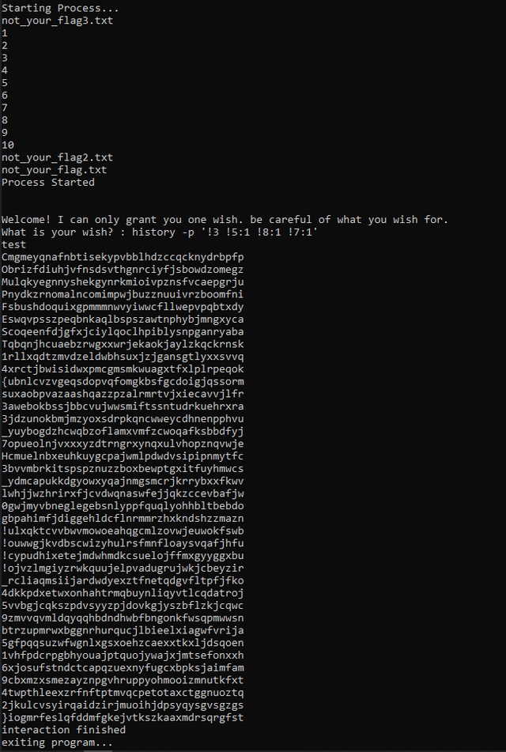

# Writeup n0talogus

by twoface


We are given IP <PORT> connect through netcat. after connecting, you can see the script. there are whitelist. you can't simply do privilege escalation or bash injection like `$0` or `bash`, etc. the correct command to execute is `history` to see the log of executed command. after that you'll see numbers of executed commands. notice there are peculiar command that includes `flag`. now we can leverage histexpand and entry point from `history` command. simply locate the location/number of `cat` command and those which contain "flag" word. you should pay attention to `cat ...` and `echo secret/../../../not_your_flag`.

to get the content of those file , use command `history -p !3:0 !5:1 !8:1 !7:1`. `-p` means print commands, and we use `!<command's_number>:<nth_token>` expansion to bypass whitelist and exploit code execution. you can now see the contents of those file printed



__Flag__
```
COMPFEST14{s33_7H3_l0g!!!!_459b516942}
```
